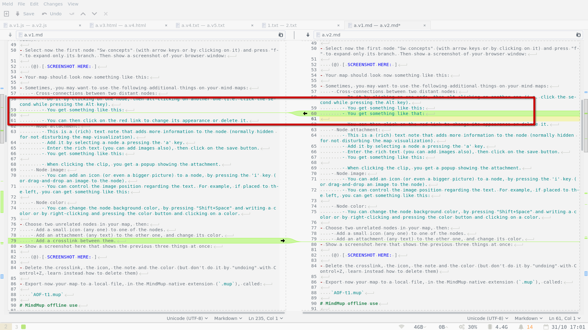
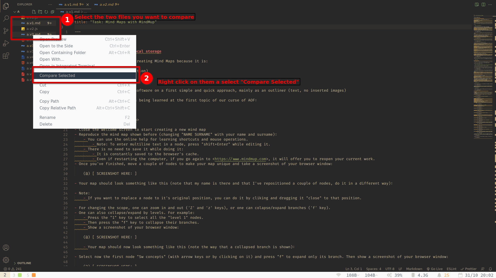

# dwec005: differences/comparison and merge/synchronization

> ## Instrucciones
> 
> - Este documento es una plantilla Markdown a rellenar.
> - Instrucciones de relleno:
>   - En cada zona numerada marcada con `{ ## SOLU:` (donde `##` es el número de
>     apartado), va tu solución a lo que se te pida en ese apartado.
>   - He citado todo el enunciado, para que se distinga muy claramente las
>     partes del enunciado de las partes que rellenas tú (tanto en el .md como
>     en previsualización).
>   - Tu solución a ese apartado ha de ir después de esa marca y antes de la llave
>     de cierre (`}`).
>   - Tu texto ahí usa párrafos separados (línea vacía arriba y abajo). Puedes
>     usar Markdown en él (enfatizar, listas, ...). Si hay varias preguntas
>     numeradas dentro de un apartado (lista numerada), usa los mismos números (lista
>     numerada) para tus respuestas.
>   - Si un apartado pide captura, hazla con el siguiente convenio de nombre:
>     - Para apartado con nº ##, la captura es `##.png`.
> 
>       Ej.: Para `{ 08 SOLU:`, la captura sería `08.png`.
> 
>     - Si un apartado pide varias capturas, los nombres tendrán letra
>       añadida creciente.
> 
>       Ej.: Para un apartado `{ 08 SOLU:`, serían `08a.png`,
>       `08b.png`, `08c.png`...
> 
>     - Todas las capturas van bajo la carpeta de este documento, dentro de una
>       subcarpeta `solu/`.
> 
>     - *Placeholders*:
>       - Cada apartado que pide captura, tiene preparado ya un *placeholder*
>         para cada captura (en la zona de respuesta correspondiente).
>       - Ej.: ``
>       - Puedes añadir texto arriba o abajo de cada *placeholder* (pero
>         respetando que sea en párrafos independientes y dentro de la zona
>         delimitada por las llaves).
>     - Capturas extra:
>       - Si requieres añadir capturas suplementarias "no esperadas", ponlas con
>          letras consecutivas (a partir de última de las esperadas, sin
>          renombrar). Añade los *placeholders* para ellas y su texto explicativo.
> - Nota: El enunciado está en inglés. Puedes responder en español a las
>   preguntas. Se apreciará el esfuerzo de intentar responder en inglés
>   lo que se pueda (pero sin usar el Google Translator).
> - Entrega:
>   - Cuando acabes, crea y entrega un zip que contenga tu versión de este
>     documento en la raíz, y las posibles capturas en subcarpeta `solu/`.
>   - Nombre del fichero zip con el convenio que usamos en las tareas.
>
> ## Differences / comparison (reading)
> 
> - In computing, many time we have two (or more) versions of a very similar
>   data.
> - Looking manually (visually) for differences can be very time consuming
>   and error prone.
> - There are tools specialized in doing this automatically. They are called  
>   *differencing tools*  
>   or  
>   *comparison tools*.
> - These tools compare and highlight the differences inside text files and/or
>   recursive differences of directories.
> - Some other tools may compare and highlight contents inside other type of files
>   (non text files or text files rendered in a different way, e.g. that use
>   markup languages). The main concepts apply to any kind of data comparison.
> - An famous example of tool for comparing text file contents or directories is
>   the  
>   `diff`  
>   command, available natively on every Unix system. The verb  
>   *diffing*  
>   is often used.
> - Knowing how to search for differences is one of the most powerful skills in
>   computing (for learning and for troubleshooting problems), just besides
>   knowing how to search "in general".
> - Diffing is also done as an essential part of version control systems (Git,
>   etc) and software development process.
> 
> ## Merge / synchronization (writing)
> 
> - Once there ara differences shown, may times we want to change one or both
>   sides with some or all data from the other side. Sometimes we want to do this
>   even without wanting to know previously the detail of the differences.
> - It is called  
>   *mirroring*,  
>   when we take a side as single reference, and the other side must become an
>   exact copy.
> - A word with a wider meaning is  
>   *synchronizing*,  
>   when we want to make both sides more or less equal, with some given rules
>   (e.g. add to each side whatever is new on each of the sides).
>   Often this is abbreviated as  
>   *syncing*  
>   or  
>   *synching*.
> - Another word that is sometimes used technically is  
>   *merging*,  
>   specially when the contents changes are more difficult to be made
>   systematically (typically when the changes to combine are inside files,
>   instead of deciding between whole files on the sides).
> - One key difference between these concepts and *copying* is their efficiency:
>   all of them avoid transfering/writing what is already equal on both sides.
> - Some of the tools that permit diffing or comparing ("reading") permit also
>   synchronizing or merging ("writing"). Other tools are specialized in
>   synchronizing ("writing") only, not on showing previously the differences.
> - An famous example of tool for efficient file synchronization is the  
>   `rsync`  
>   command, available natively on many modern Unix system. Here, differences
>   inside files are not mixed: only one of the two sides prevails for each
>   side... But for efficiency, it only transfers/copies the parts that differ.
>   This can represent a huge benefit in performance (locally, and specially
>   across a network).
> - Merging is also done as an essential part of version control systems (Git,
>   etc) and software development process.
> 
> ## Some software examples
> 
> - Some OS native options from command line (text interface):
>   - Diffing:
>     - `diff` on Unix-like (use `-y` option for side-by-side comparison, and
>       `-r` for directory comparison).
>     - `fc` on Windows (less powerful).
>   - Synching:
>     - `rsync` on Unix-like.
>     - `robocopy` on Windows (less powerful).
> - Some free software and multiplatform (for dekstop) GUI programs
> - **Meld**
>   - Graphical tool for diffing and merging inside text files and also
>     directories.
>   - Permits editing on the fly. Can be integrated with a version control system.
> - **FreeFileSync**
>   - Specialized in diffing and merging (synchronizing) directories.
>   - Much more quick and powerfull than Meld in this case...
>   - But does not natively show differences inside text files.
> - **VScode**:
>   - Like many text editors and IDEs, it has natively visual diff/merge
>     functionnality and control version integration.
>   - It has lass extensions for comparing directories.
>   - More limited functionnality for that than specialized tools.
> 
> ## Unpack the provided ZIP
> 
> - Do an "extract here" of the provided file
> 
>   `task-diff-merge.zip`
> 
> - It contains tree directories:
>   - `etc.v1/` and `etc.v2/`:
> 
>     Two directories with lots of equal things, and some differences.
> 
>   - `a/`:
> 
>     A directory containing some sample files in different formats that have very
>     similar contents.
> 
> ## Meld, compare two text files
> 
> - Install Meld on your system (from <https://meldmerge.org>).
> - Open Meld and compare these two files under `a/`:
>   - `a.v1.md`
>   - `a.v2.md`
> - Note:
>   - Put the first one on the left side, and the second on the right side.
>   - Sometimes there is not really a known older or newer side, but often there
>     is. In that case, the typical convention is to put the older on the left
>     and the newer on the right and using this consistently to reduce confusion.
> - You will see both files opened side by side. The cursor is automatically
>   placed at the first difference.
> - Normal navigation and search
>   - You will see that movements (vertical and horizontal) are synched between
>     both sides.
>   - Move around vertically with the scroll wheel on one document. Move
>     horizontally (on long lines) with `shift+ScrollWheel`.
>   - Move with the keyboard (arrows, PgUp/PgDown, ...).
>   - Search with `ctrl+F`, for example the word "file", and press several times
>     `Enter`/`shift+ Enter` go to the next/previous occurrences.
> - Navigate through differences
>   - At each side, there is a scroll bar that acts like a map, hightlighting the
>     places where there are differences. You can click on any place of this
>     scrollbar to jump to that place.
>   - If you use the scrollwheel when the mouse pointer is in the blank region
>     **between** the two documents, you will jump through the differences in the
>     document. Try it.
>   - Jumping through differences can also be done by clicking the arrow
>     buttons in the top toolbar. Try them.
> - Answer to these questions:
>   1. What are the keyboard shortcuts to jump to the next/previous difference?
>      Try them.
>   2. How does Meld represent a line that is only on one of the two sides?
>   3. How does it represent a line that is present on both sides, but with
>      different text somewhere inside it?
>   4. How does it represent the particular text that is different between these
>      two lines?
>   5. Does Meld always align exactly the text that is common in both sides? How
>      does it show the relationship between a difference in both sides?
>   6. By default, are white spaces considered differences?
>   7. By default, is it case sensitive on the differences?
>   8. By default, are long lines wraped?
>   9. How can we make that movements on both sides are independent
>      (unsynchronized)? (hint: look at the "View" menu). Try it, and then leave
>      it back as normal.
> 
> { 01 SOLU:

1. <kbd>Alt</kbd> + <kbd>Down</kbd> to next difference,\
<kbd>Alt</kbd> + <kbd>Up</kbd> to previous difference.

2. With **green** highlighting.

3. With **blue** highlighting.

4. With a **darker blue** highlighting (**lighter blue** if you're using a d a dark theme).

5. No. The highlighting is linked between the common text with differences on both sides.

6. Yes, it considers spaces, tabs and line breaks as differences, and shows whitespace characters.

7. Yes, it's case sensitive on the differences.

8. No, you have to do horizontal scrolling (<kbd>Shift</kbd> + <kbd>Scrollwheel</kbd>).

9. Unchecking the **Lock Scrolling** option at the "View" menu.

> }
> 
> - **Place** yourself on the **last difference** in the document.
> - On the right side, replace "Apellido1 Nombre" with your Surname and Name.
> - Meld shows an asterisk near the file name in the title bar, to indicate
>   that there are unsaved changes. Save the change with `ctrl+S`.
> - Open the Preferences window and activate the option for highlighting the
>   current line. Close the Preferences to see the effect on the document.
> - Open again the Preferences window and move it so that your inserted name
>   and surname are visible.
> - Provide a screenshot of the whole Meld window (the Preferences window is also
>   visible)
> 
> { 02 SOLU:

> }
> 
> - See the live effect of the following options (they are inmediately applied
>   on the visualization):
>   1. Option that wraps the long lines.
>   2. Option that does syntax highlighting.
>   3. Option that shows the line numbers.
>   4. Option that shows non-printing characters.
>   5. Highlight current line (this one is not live updated).
> - Provide a screenshot of the whole Meld window (the Preferences window is also
>   visible), with all these options activated. Annotate the screenshot to
>   highlight an example of the effect of each option in the document displayed
>   (for each option, use the corresponding number on the previous list).
> 
> { 03 SOLU:

> }
> 
> - Answer to these questions:
>   1. Which are the line numbers of the left document for the lines that are
>      **only** on the left document.
>   2. Which are the line numbers of the right document for the lines that are
>      **only** on the right document.
>   3. Which are the line numbers of the left document for the lines that are
>      present on both sides but are **different**.
>   4. Observe that one of the differences shows a line that is equal but in
>      different place in both documents (a line that has been moved). Which is
>      its line number in the left file? How is this case represented? Is
>      the interface visually helping to distinguish this particular case (lines
>      movement) from other cases?
> 
> { 04 SOLU:

1. Lines number 79, 131 to 148, and 175.

2. Lines number 122 and 158.

3. Lines number 43, 59, 163, 207 and 208.

4. Line number 175. It's represented with a **light green** highlighting.
It continues the highlighting to the other side (the other document) just below the same text that have on the previous line (on the original document). 

> }
> 
> - Imagine having to answer to the previous questions without the help of a tool
>   (visually comparing these 2 files side by side). Even if they are only
>   around 200 lines long, it would take a long time. And you would surely
>   "miss" many small differences. And now imagine comparing files having 5000
>   lines. And comparing dozens of files having 5000 lines each.
> - Sometimes even with the tool, too much unnecessary differences are highlighted.
> - Compare in a new tab these two JS code files under `a/`:
>   - `a.v1.js`
>   - `a.v2.js`
> - You will see that a lot of differences are shown. In this particular case,
>   most of them are really "noise", since they do not affect the code (they are
>   white spaces related or occur inside comments). They make more difficult to
>   see the changes affecting the code.
> - Try to find the bug in the right side of the code.
> - Open the preferences, and in the text filter tab, see the live effect of
>   activating these filters:
>   1. Filter out differences in whitespaces.
>   2. Filter out differences in C++ style comments (in lines starting with `//`)
>   3. Filter out differences in C style comments (in text inside `/* */`).
> - Leave them activated and close the Preferences window.
> - On the right side, replace "Apellido1 Nombre" with your Surname and Name and
>   save the file.
> - Provide a screenshot of the whole Meld window, that shows all the remaining
>   highlighted differences. Annotate the screenshot to highlight one example of
>   the effect of each option in the document displayed (for each option, use the
>   corresponding number on the previous list).
> 
> { 05 SOLU:

> }
> 
> - Answer to these questions:
>   1. What is the line of the bug on the right side file? What was exactly the
>      bug? Note that with the filter, it is much easier to find it.
>   2. What kind of differences are still shown that still don't affect the code?
> 
>      Note: other tools may help to get rid of these differences also.
> 
> { 06 SOLU:

1. The bug is at line 13. On the **left** side there's an `<h1>` element but on the **right** side there's an `<h>`(which is not an HTML element as far as I know).

2. Comments that exists on one side only, longer block comments, and line breaks inside the code.

> }
> 
> - Note: Other ways for opening Meld
>   - It can be used from the command line, specifying the files or directories to
>     compare as arguments.
>   - The `File` menu permits easily reopening recent comparisons.
> 
> ## Meld, compare other types of files
> 
> - Compare with Meld the two `.html` files that are in `a/`.
> - What are exactly the differences in both documents? (provide line numbers of
>   the left document, and describe the differences)
> 
> { 07 SOLU:

- At line number 149 there's a difference on the spelling of the word **color**(US)on the left, and **colour**(UK) on the right side.

- At line number 251 onthe left side there's the word **open** and on the right side there's the word **close**.

> }
> 
> - Typical file differencing tools show differences only for text files. And if
>   they are markup languages like this example, they show differences on the
>   "source", not on the rendered document.
> - One of the many powerful benefits of using text based file formats is
>   precisely this one: being able to compare them easily, and with the tool of
>   our choice.
> - Other differencing tools may be more "smart" and/or specialized and show the
>   differences of the rendered graphical result, or be able to show visually the
>   differences in the rendering of some particular binary file formats (.pdf,
>   .doc, .xls, image files, ...).
> - In any case, if we have only a text differencing tool (like Meld), we can many
>   times use it for comparing documents that are in binary form, but that
>   represent text somehow. At least compare the contents (not the format). There
>   is a little work involved, but it can be worth many times.
> - Let's see how with some examples.
> - If the program that opens and renders the file permits exporting to a text
>   format, we can use that.
> - Open with Writer or Word the two `.docx` documents that are under `a/` and
>   save them as plain text.
> - Compare these two text files with Meld. Provide a screenshot of the Meld
>   window then:
> 
> { 08 SOLU:

> }
> 
> - What are exactly the differences between both documents? (provide line numbers
>   of the left document, and describe the differences)
> 
> { 09 SOLU:

- At line 9 of the left document there's a text line with the word **Multiplatform** that doesn't exists on the right document.

- At line 25 of the left document theres's the word **Your**, and on the right document there's the word **My** (at line 24).

- Below line 55 on the left document, the word **Hello** is missing (line 55 on the right document).

- At line 93, on the left document there's the word **out**, and on the right document there's the word **in**.

> }
> 
> - We've seen how to use this "trick" for comparing `.docx` documents as an
>   example. In that case, it is not strictly necessary. Writer and Word are able
>   to natively compare documents. Open the second `.docx` (`a.v5.docx`) with
>   Writer or Word, and look for the menu entry for comparing it with the first
>   `.docx` (`a.v4.docx`).
> - If there is a subwindow that shows the list of changes, close it.
> - You will see that the differences are highlighted "inline", and not
>   side-by-side.
> - Show a screenshot of the Writer or Word window with some of the differences
>   highlighted:
> 
> { 10 SOLU:

> }
> 
> - Answer these questions:
>   1. How does the interface highlight the things only present in the file
>      that we opened initially?
>   2. And the things that are only present in the other file?
>   3. If we have an old and new version of a file, which one should we open
>      first, and then compare against the other (so that the visual differences
>      are intuitive)?
> 
> { 11 SOLU:

1. It changes the font color of the word to some kind of **yellow** and **underlines** it.

2. It shows it with the same **yellow** color than before but with **strikethrough** instead of underlining.

3. In this case you should open the new version of the document.

> }
> 
> - If the program that opens does not permit exporting to plain text, many times
>   we can at least use the menu "Edit/Select all" (or Control+A), then copy, then
>   paste into a text editor and save it as a new text document.
> - For example, open the two `.pdf` files and put their text contents into two
>   files named `1.txt` and `2.txt`, and compare these two text files with Meld.
> - Provide a screenshot of the Meld window then:
> 
> { 12 SOLU:

> }
> 
> - What are exactly the differences between both documents? (provide line numbers
>   of the left document, and describe the differences)
> 
> { 13 SOLU:

- At line 117 the word **your** is missing on the left side.

- At line 133 a **colon** is missing at the end of the sentence on the left document.

> }
> 
> ## Meld, merge two text files
> 
> - In the previous section, we were only "reading" (observing differences). In
>   this one we are going to merge differences.
> - Compare again with Meld the files `a.v1.md` and `a.v2.md`.
> - On each difference, you will see in the central colum some arrows: clicking on
>   the arrow makes the text difference to be copied in the "direction of the
>   arrow" (frow one side to the other).
> - We can be making changes on both files. Many times, we may think which one of
>   the two we want to modify (maybe in order to create a third file, by finally
>   saving it as a new file).
> - If the left side is the original, and the right a modification, merging will
>   consist in accepting or rejecting the changes that have been made on the
>   modification. Or in some differences, create a third possibility that is none
>   of the two.
>   - Let's imagine that in the v2 file (on the right), the first difference is in
>     fact an error that should be rolled back. Jump to that first difference and
>     click on the left arrow of the two (direction left to right). Observe how,
>     on that place, the right side becomes like the left side, and that
>     difference disappears.
>   - Go now to the next difference. This is another line that is different on
>     both sides. By pressing shift key, you will see that the arrows become
>     crosses ("X"). This means that if we press an "X" on one side, that side of
>     the difference will be deleted. Press shift and click on the "X" that is on
>     the right, to delete the right text. We've transformed the difference into a
>     new one (a text that is on the left but not on the right). Show a screenshot
>     of the Meld window showing this:
> 
> { 14 SOLU:

> }
> 
> - Press Control+z to **undo** this change you've made.
> - Now press the **Control** key instead of the Shift key. The arrows instead of
>   becoming a "X", they become now a "+". Click on the "+" that is on the left
>   side. What does exactly happen? Provide also a screenshot of the Meld window.
> 
> { 15 SOLU:

- It copies the line to the other document, giving you the option to **copy up** or **copy down**.

> }
> 
> - Press Control+z to **undo** this last change.
> - Meld is in fact a text editor: we are free to write and delete whatever we may
>   decide on any side. For example, on this difference, we may decide that the
>   right side is the correct one, but it needs for example an extra word. Insert
>   manually on the right side, after the last word, the word  
>   "thing".
> - Observe that the difference is updated accordingly.
> - Now go to a couple of lines below, and delete any word. Observe that the new
>   difference that you have just created is highlighted. Show a screenshot of the
>   Meld window now:
> 
> { 16 SOLU:

> }
> 
> - You could traverse the whole file jumping from difference to difference and
>   deciding what to do. Many of these actions can also be done with keyboard
>   shortcuts (so we are able to merge two files quickly without even using the
>   mouse).
> - Let's imagine that we have finished our merging. We could save the file on the
>   right and overwrite it with our modifications. In this case this may not be a
>   good idea, since the right side has already a version (`v2`) that may have
>   already been published. So it is preferably to save it as a new version. We
>   could call it `v3`. But if we observe this case, there is already a `v3`
>   version of that file (that may be already published and we should not
>   overwrite). So what we are going to do now is a "subversion": save the right
>   side file as  
>   `a.v2.1.md`
> - We have just done what is called a **branch** or a **fork** in software
>   development terms: doing a subversion that creates a new branch independent of
>   the main one that already exists.
> - Notes:
>   - Both Writer and Word, permit besides highlighting the differences between
>     two files, merging the contents. The interface is different from what we've
>     seen in Meld, but the underlying concepts are the same.
>   - Real-time collaborating tools have a more interactive approach to all this
>     issues. They are currently used extensively in document editing, starting
>     with Google Docs, and followed by the other ones (e.g. Office 365).
>   - Version control systems do usually automatic merging of code when no
>     conflicts are detected, and ask to the user to manually resolve when they
>     are not able to do so. In these cases, a visual merging tool as we have
>     seen is really convenient.
> 
> ## Meld, compare and merge three files
> 
> - In many situations, we have three versions of the same file that we have to
>   consider, instead of two.
> - For example: imagine a file that has been edited independently by two persons.
>   In our example files, this could be the `v2` file provided, and the
>   independent modifications the `v3` and the `v3bis`.
> - Compare with Meld the `v2` and the `v3` files. Indicate with line numbers and
>   a description which are the differences between the two files:
> 
> { 17 SOLU:

- At line 15 there's the word **Note** on the left document, and the word **Warning** on the right document.

- At line 76 there's the word **two** on the left document and the word **four** on the right document.

- At line 119 on the left document, there's a line of text that doesn't exists on the right document.

- Below line 130 on the left document a bunch of lines that only exists on the right document are missing (lines 130 to 147 on the right document).

- Below line 148 on the left document a line that only exists on the right document is missing (line 166 on the right document).

> }
> 
> - Now compare with Meld the `v2` and the `v3bis` files. Indicate with line
>   numbers and a description which are the differences between the two files:
> 
> { 18 SOLU:

- Below line 38 on the left document a line that only exists on the right document is missing (line 39 on the right document).

- At line 76 there's the word **your** on the left document and the word **my** on the right document.

- At line 119 on the left side, there's a line that is missing on the right document.

- Below line 130 on the left document a bunch of lines that only exists on the right document are missing (lines 131 to 148 on the right document).

- At line 190 on the left document there's a name (Vila Berni) and on the right document (line 208) there's only whitespace.

> }
> 
> - Close the Meld window.
> - We can have a look at the same time the three files. This is what is called
>   a "3-way diff". Open with Meld the three files, in that order (`v2`, `v3` and
>   `v3bis`).
> 
>   - Note: You can do it from the graphical interface (activating the 3-way check
>     case), or from the command line (specifying the 3 arguments).
> - Show a screenshot of the Meld window:
> 
> { 19 SOLU:

> }
> 
> - We could also do now what is called a 3-way merge: choose one of the files,
>   for example the `v3` that is on the center, and merge on it things from the
>   other two. Then finally saving it as a new different version. It could be v4.
>   But in this case, this version already exists also, so again we would make a
>   branch.
> - Close the Meld window.
> - All what we are seeing here is not easy even if we are helped with a merging
>   tool, and it's really hard without the help of a merging tool. Some of the
>   merges may be decided and executed automatically, but some of the collisions
>   need human intervention.
> - Programmers do this things constantly and it's called version control (and
>   there are further tools heping in this).
> - Having branches and patching and merging them at some moments is very human
>   ressource consuming. That's why software companies have big interests in
>   mantaining only the last version of a software, and doing all the changes
>   there (error fixes **and** new functionnality). This simplicity is at the cost
>   of the user, that loses the possibility of having a stable software that only
>   changes for error fixes. For sure, the software company interest is to
>   convince us that the new is always better and never breaks anything, but there
>   is a conflict of interests here.
> - Concerning document editing (instead of programming), it also makes sense
>   having versions, making differences and merges between them, collaborating.
>   Fortunately in that case, branchs do not normally occur: there is usually only
>   a last and "better" version... But also it is very interesting there to
>   highlight differences between versions. Lightweight markup language (e.g.
>   Markdown) are specially adecuate for this (they are very simple text files
>   that can be easily compared and merged with any tool we want).
> 
> ## Meld, compare two dirs
> 
> - Instead of two files, we can compare two dirs with Meld.
> - Compare with Meld the two provided directories
> 
>   `etc.v1`
> 
>   `etc.v2`
> 
> - Unfortunately, the trick of scrolling through differences on the center bar
>   does not work here. But we have the buttons and shortcut keys for jumping
>   through differences, and the "summary" scroll bar to jump directly to a place.
>   Try all of them.
> - Observing the differences, answer to these questions:
>   1. How does Meld show the files that are only present in the second
>      directory? Enumerate also them in this particular case.
>   2. How does Meld show the files that are only present in the first
>      directory? Enumerate also them in this particular case.
>   3. How does Meld show the files/dirs that have been renamed? Enumerate also
>      them in this particular case.
>   4. How does Meld show the files/dirs that have been moved? Enumerate also
>      them in this particular case.
>   5. How does Meld show the files that have different contents on both sides?
>      Enumerate also them in this particular case.
> 
>      Note that in all this, Meld does not "care about" which of the two sides is
>      more recent (it shows us the date/time of each file for our information).
>   6. On the top toolbar, at the end (right side) there are **four** interesting
>      buttons for filtering the results. Try them and describe what they are for
>      (**four buttons**).
>   7. Go to the first file that has different contents on both sides, and
>      doubleclick it (the one on the left or the one on the right). What
>      happens?
>   8. Enumerate the changes between these two files (providing line numbers).
>   9. How can I come back to the directories comparison? Do it.
> 
> { 20 SOLU:

1. It shows them with **green bold** font, and expanding the directory to show the content(with the same **green bold** font) on the right side, and with strikethrough (also expanded) on the left side.
   * _config_, _unity.ini_ (inside **compizconfig.old** that also only exists on the right side).
   * _network-manager_ (inside **dnsmasq.d** that also only exists on the right side, and inside **dpkg**).
   * _hello-I-m-here.txt_ (inside **panic**).

2. It shows them the same way (**green bold** font, and expanding the directory to show the content(with the same **green bold** font) but on the left side.

   * _config_, _unity.ini_ (inside **compizconfig** that also only exists on the left side).
   * _network-manager_ (inside **dnsmasq.d** that also only exists on the left side).
   * _menu.xml_ (inside **openbox**).

3. It shows them with **blue bold** font.

   * _README_ ( inside **udev/rules.d**).
   *  _adduser.conf_

4. If files are moved to another place, it shows them also with **green bold** font, because doesn't exists on the same place on both sides.

5. It shows them with **blue bold** font.

   * _README_ ( inside **udev/rules.d**).

6. Those four buttons are:

   * **Same**: it shows identical files and directories.
   * **New**: shows new files and directories.
   * **Modified**: shows modified files and directories.
   * **Filters**: it expands a menu with five options to filter files by type.
      * Backups
      * OS-specific metadata
      * Version Control
      * Binaries
      * Media

7. A **new comparison** opens up on a **new tab** between the two files with the same name.

8. Differences between the two _README_ files:

   * At line 10, there's the word **two** on the left side, and the word **three** on the right side.
   * Below the line 19 on the left side, a line is missing (line 20 on the right side).

9. You can close the tab, and continue examining the directory comparison.
 
> }
> 
> - Close the Meld window.
> 
> ## Meld, merge two dirs
> 
> - Once two dirs are opened and compared, Meld can help us to merge their
>   contents: we synchronize them "manually" in a very controlled way, choosing in
>   each case what to do.
> - For each difference, we can choose one of the sides as the good one,
>   and decide what to do regarding the other side (if copying to it or
>   not).
> - In the case of a file that is present on both sides, we can decide to
>   overwrite one side with the other, or opening these two files and
>   merging the differences inside them (this will only work for text
>   based files).
> - A difference with file comparison, is that we cannot do the changes and
>   finally "save with a different name": if we do transfers/copies/deletions,
>   they apply inmmediately. There are no "undos" here.
> - **Without doing any of the actions**, answer to these questions:
>   1. How can I copy to the right one of the files that is only present
>      on the left? (answer, but *don't do it*)
>   2. If on the right there is a file that is not on the left, but I decide that
>      the left side is the correct (in this case "no file"), what can I
>      do to make the right equal to the left side on that difference? (answer,
>      but *don't do it*)
>   3. If one file exists on the left and on the right with different contents,
>      how can I put on the right the one that is on the left? (answer, but
>      *don't do it*).
>   4. If one file exists on the left and on the right with different contents,
>      how can I incorporate to the one of the right the interesting parts of
>      the one that is on the left? (answer, but *don't do it*)
> 
> { 21 SOLU:

1. By clicking on the **Copy to Right** button on the top bar.

2. You can click on the **Delete** button on the top bar.

3. By clicking on the **Copy to Right** button on the top bar.

4. By double clicking on one of the two files, and in the new comparison that opens up, clicking on the arrows besides the content you want to incorporate to the file on the right (arrows pointing to the right).

> }
> 
> ## Meld, compare and merge three dirs
> 
> - To test this, make a copy of directory
> 
>   `etc.v1`  
> 
>   and rename it to
> 
>   `etc.v1bis`
> 
> - Go to that new directory, and:
>   - delete the file
> 
>     `passwd`
> 
>   - rename the file
> 
>     `hostname`
> 
>     to (replace with your Surname and Name):
> 
>     `Apellido1Nombre`
> 
>   - Delete the first line of the file
> 
>     `adduser.conf`
> 
> - Compare these three directories with Meld, so that `etc.v1` is on the left,
>   `etc.v1bis` on the center and `etc.v2` on the right.
> - Make that files that are equal are **not** shown in Meld. Go to the end of the
>   scroll in Meld, then provide a screenshot of the Meld window (should show the
>   last differences):
> 
> { 22 SOLU:

> }
> 
> - Double-click on the file
> 
>   `adduser.conf`
> 
>   and provide a screenshot of the Meld window after that:
> 
> { 23 SOLU:

> }
> 
> ## VScode
> 
> - Open in VScode these two files under `a/`:
>   - `a.v1.md`
>   - `a.v2.md`
> - Show an annotated screenshot of the VScode window, showing the way of
>   launching their comparison:
> 
> { 24 SOLU:

> }
> 
> - Show a screenshot of the VScode window, showing the comparison:
> 
> { 25 SOLU:

> }
> 
> - Show an annotated screenshot of the VScode window, showing the way of
>   launching the comparison of `a.v1.md` against `a.v3.md` that is not yet
>   opened in VScode:
> 
> { 26 SOLU:

> }
> 
> - Show a screenshot of the VScode window, showing the comparison:
> 
> { 27 SOLU:

> }
> 
> - Note: another way to launch a comparison with VScode is from command
>   line, with the `-d` option:
> 
>   `code -d FILE1 FILE2`
> 
> - VScode handles quite well the following use case. When closing a file
>   with unsaved changes, we are asked if we want to save.  Sometimes, this
>   surprises us: we don't remember having made changes:
>
>   - If we save the current version assuming that it is the best one, we may
>     be saving some unwanted keystrokes we made accidentaly on the editor.
>   - If we leave the original, we may be missing something meaninful that
>     we added (but forgot to save).
> 
>   When we get this prompt (or at any moment we decide), VScode permits
>   comparing what is on memory against what is on disk. We can have a quick
>   view that everything is as expected and decide what to do. We can make
>   "ctrl+z" on the current version to undo unwanted "last changes" until we
>   leave only the differences (if any) that look OK.
> - Let's reproduce this.
> - Go in VScode to the opened tab for `a.v1.md` (not the comparison tab,
>   but the normal editing tab). It should be in a saved state.
> - Change two consecutive words with your name and surname.
> - Show an annotated screenshot of the VScode window, showing the way of
>   launching the comparison of `a.v1.md` against its saved state.
> 
> { 28 SOLU:

> }
> 
> - Show a screenshot of the VScode window, showing the comparison:
> 
> { 29 SOLU:

> }
> 
> - Another common use case is when we are with an opened file in a text
>   editor (modified or not in memory by us at that momment), and something
>   is changing it externally. It may be ourserlves with another program
>   (conciously or not), or some program that is changing it automatically
>   (expectedly or unexpectedly).
> - Many text editor detect this situation and prevent us, asking us to
>   decide if reloading what is on disk or discarding that in favor of what
>   we have in memory.
> - VScode goes beyond this:
>   - If what is changed externally in disk does no conflict (not same
>     lines) with changes we may have done, it loads these changes
>     automatically (without prompting). This may be quite handy, but many
>     coders find that this should have a prompt like other editors do (or
>     at least allow to configure VScode to behave like this). See [issue
>     #23107](https://github.com/microsoft/vscode/issues/23107) (still
>     opened as of 2020).
>   - If there is a conflict (same line edited), it prompts the user, but
>     giving the possibility to compare against what conflicts in order to
>     decide how to merge.
> - Let's see this.
> - Go in VScode to the opened tab for `a.v2.md` (not the comparison tab,
>   but the normal editing tab). It should be in a saved state.
> - From VScode, change a random word in the file, **without saving**.
> - Now open the file externally with a different text editor. Change a
>   random word that is in a nearby line of your previous change made on
>   VScode (but not in the same line). Save that change from the different
>   text editor, and exit it.
> - See that VScode updates that line on screen (without notifying): it
>   reloads what is on file and merges with what is in memory.
> - Save from VScode. File is saved with **both** changes, without having
>   prompted anything.
> - We could now happily close the file in VScode. But let's simulate a
>   conflict.
> - From VScode, change two consecutive words in a given line with your name
>   and surname, **without saving**.
> - Now open the file externally with the different text editor, and edit
>   **the same line** that you changed with VScode (in a different place of
>   the line or in the same place), and save and exit.
> - Now try to save from VScode.
> - Show an annotated screenshot of the VScode window, showing the prompt
>   that is shown when trying to save in this case.
> 
> { 30 SOLU:

> }
> 
> - Choose the option that permits comparing, and show a screenshot of the
>   VScode window, showing the comparison:
> 
> { 31 SOLU:

> }
> 

